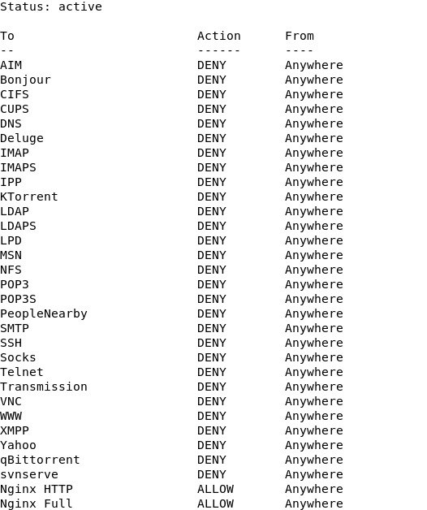
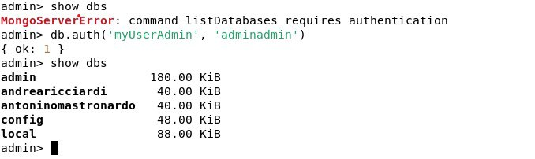
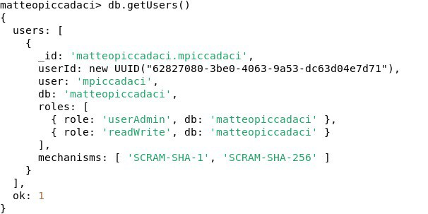
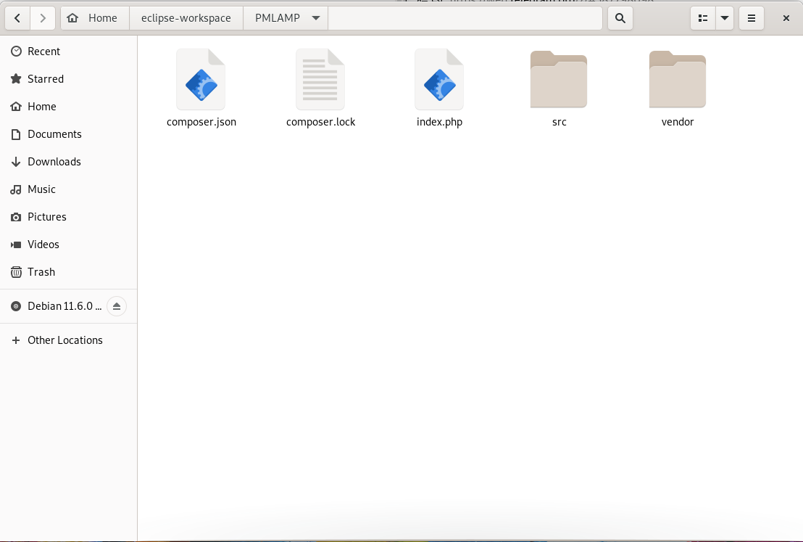

# PMLAMP
## P(Piccadaci) M(Mastronardo) L(Linux) A(A web server) M(Mysql/Mongodb) P(PHP/Perl)
Progetto sviluppato su Debian GNU/Linux 11 (architettura x86) dove un _amministratore gestisce una classe di studenti_.
Agli studenti è concessa la possibilità di:
- creare pagine web in locale, tramite Eclipse PHP IDE;
- accedere ai database sql e nosql.

---

# Moduli di Perl
Prima di cominciare bisogna installare tutti i moduli di perl necessari per l'esecuzione degli script.
```bash
perl -MCPAN -e shell # apertura della shell di CPAN (Comprehensive Perl Archive Network)
install Expect
install DBI
install MongoDB
```

---

# Creazione dell'utenza
L'amministratore può creare nuovi utenti e aggiungerli automaticamente al gruppo _Studenti_ tramite lo script ```addStudent.pl```.

```perl
use Expect;
print ("Inserisci il nome dello studente: ");
$nome=<>;
chomp($nome);
print ("Inserisci il cognome dello studente: ");
$cognome=<>;
chomp($cognome);
$username=lc($nome) . lc($cognome);
my $exp = new Expect;
$exp->spawn ("sudo adduser " . $username);
$exp->expect (undef,"New password: ");
$exp->send ($username . "\n");
$exp->expect (undef, "Retype new password: ");
$exp->send ($username . "\n");
$exp->expect (undef, "Full Name \[\]: ");
$exp->send ($nome . " " .  $cognome . "\n");
# aggiunta delle altre informazioni ...
$exp->expect (undef, "Is the information correct? ");
$exp->send ("Y\n");
system ("sudo usermod -a -G Studenti " . $username);
```

Le utenze appartenenti al gruppo _Studenti_ hanno i seguenti privilegi:
```perl
system ("sudo mkdir -p /home/Lavori/" . $username);
system ("sudo chown " . $username  . ":administrator /home/Lavori/" . $username);
system ("sudo chmod 770 /home/Lavori/" . $username);
system ("sudo chown " . $username  . ":administrator /home/" . $username);
system ("sudo chmod 770 /home/" . $username);
```

_Lavori_ è la cartella condivisa tra gli utenti del gruppo _Studenti_ e l'**amministratore**.
I permessi di lettura, scrittura ed esecuzione sui file all'interno di questa cartella sono concessi esclusivamente all'utente proprietario e all'amministratore.

Ogni utente ha la propria home in quanto è stato usato il comando ```adduser```, e solo l'utente proprietario e l'amministratore possono accedere ai file al suo interno.

Le suddette utenze non potranno eseguire nessun comando ```sudo``` da terminale perché non fanno parte del ```sudoers group```.

Per controllare l'uid, il gid e i gruppi a cui appartiene un utente si può usare il comando ```id```:
```bash
uid=1000(matteopiccadaci) gid=1000(matteopiccadaci) groups=1000(matteopiccadaci),1002(Studenti)
```

L'amministratore può visualizzare la lista dei gruppi e degli utenti (non di sistema) tramite lo script ```group.sh```:
```bash
sudo chmod 770 /home/administrator/group.sh # do i permessi di esecuzione per lo script
```

```bash
sudo getent passwd {1000..65533} | cut -f 3,5 -d : | sed 's/,,,//' > users.txt
sudo getent group {1000..65533} | cut -f 1,3 -d : > groups.txt
```

# Backup della cartella condivisa
Per questioni di sicurezza e/o di integrità del dato, viene effettuato backup delle cartelle degli studenti, collocate nella cartella condivisa _Lavori_.
Il backup è una cartella nascosta visibile solo all'amministratore e viene create all'interno della cartella _Lavori_.

```bash
cd /home/Lavori
mkdir .backup
sudo chown administrator:administrator .backup
sudo chmod 770 .backup
```

L'amministratore può eseguire il backup in qualiasi momento eseguendo lo script ```Studentsbackup.pl```:
```perl
$studentString = `sudo getent group | cut -f 3,4 -d : | grep 1002 | cut -f 2 -d :`;
my @students = split (',', $studentString);
foreach my $st (@students){
chomp($st);
$filename= "backup-". $st . "-'" . localtime() . "'.tar.gz"; 
system("sudo tar -cvzf /home/Lavori/.backup/" . $filename . " /home/Lavori/" . $st);
}
```
Il backup viene effettuato in formato ```.tar.gz``` e viene salvato nella cartella ```.backup``` con il nome ```backup-<nomeutente>-<data>.tar.gz```.

## Cron
Per eseguire il backup seguendo una routine periodica è necessario utilizzare il servizio basato sul tempo chiamato **Cron**, implementato attraverso l’uso del demone ```crond```. Il demone ha il compito di svegliarsi ogni minuto ed eseguire ogni programma che è stato programmato per quel momento.
Il file di configurazione principale di crond è ```/etc/crontab``` che contiene l’elenco delle operazioni periodiche generali da eseguire nel sistema (denominate ```cronjob```).
Successivamente vengono ispezionati file di due directory:
- ```/etc/cron.d/```;
- ```/var/spool/cron/crontabs``` contenente i crontab personali degli utenti.

Come appena accennato, il servizio cron è in grado di eseguire anche operazioni richieste da un singolo utente; in questo caso questi dovrà creare un suo crontab personale invocando il comando:
```bash
sudo crontab -e
```
Il formato di questo file è identico a quello di ```/etc/crontab```, dove l'unica differenza è che non è necessario specificare l'utente dato che è già ben definito.
Si può mostrare a schermo la lista delle operazioni programmate usando il comando:
```bash
crontab -l
```
Per verificare che il servizio sia attivo si lancia il comando:
```bash
systemctl status cron
```

La sintassi per le espressioni cron si può suddividere in due elementi: **la pianificazione** e **il comando da eseguire**.

La componente di pianificazione della sintassi è suddivisa in 5 diversi campi, che vengono scritti nel seguente ordine:

|     Field        | Allowed Values  |
|:----------------:|:---------------:|
| Minute           | 0-59            |
| Hour             | 0-23            |
| Day of the month | 1-31            |
| Month            | 1-12 or JAN-DEC |
| Day of the week  | 0-6 or SUN-SAT  |

Nelle espressioni cron, un asterisco è una variabile che rappresenta tutti i valori possibili. Pertanto, un'attività pianificata con * * * * * oppure */1 * * * * ... verrà eseguita ogni minuto di ogni ora di ogni giorno di ogni mese.

## Anacron
Anacron è utile per eseguire comandi periodici, con una frequenza definita in giorni, su computer desktop o laptop che non sono sempre accesi.
Anacron garantisce che il comando verrà eseguito al prossimo boot del computer.

- Gli **anacron job** sono elencati nel file ```/etc/anacrontab``` e possono essere programmati usando il seguendo formato:
```bash
period   delay   job-identifier   command
```
- **period**: questa è la frequenza dell'esecuzione del job specificata in giorni;
- **delay**: è il numero di minuti di attesa prima di eseguire un job;
- **job-id**: è il nome univoco per il job;
- **command**: è il comando o lo script da eseguire (_per eseguire script diversi da quelli .sh c'è la necessita di specificare anche il path del compilatore_).

Anacron verificherà se un _job_ è stato eseguito entro il periodo specificato nel campo del _period_. In caso contrario, esegue il comando specificato nel campo _command_ dopo aver atteso il numero di minuti specificato nel campo _delay_.
Una volta che il job è stato eseguito, nella directory ```/var/spool/anacron``` viene creato un file con il nome del job-id contenente il timestamp dell'ultima esecuzione.

Se la macchina è accesa anacron esegue il job nella fascia oraria specificata dalla variabile di ambiente ```START_HOURS_RANGE``` presente nel file ```/etc/anacrontab```.

- L'anacron job pianificato per questo progetto è il seguente:
```bash
START_HOURS_RANGE=7-9

90   10    backup   /usr/bin/perl /home/administrator/Studentsbackup.pl
```
Il backup viene effettuato ogni ```90 giorni``` tra le ```ore 07:00 e le 09:00``` se la macchina è **accesa**.
Altrimenti viene effettuato all'avvio successivo della macchina.

Per permettere l'esecuzione dello script ad anacron è necessario dare i permessi di esecuzione:
```bash
sudo chmod 770 /home/administrator/Studentsbackup.pl
```

Per verificare che il servizio sia attivo si lancia il comando:
```bash
systemctl status anacron
```

Per monitorare i log di anacron basta controllare il file di log di sistema ```/var/log/syslog``` lanciando il comando:
```bash
sudo grep anacron /var/log/syslog
```

|                   Cron                                    |     Anacron     |
|:---------------------------------------------------------:|:---------------:|
| È un demone                                               | È un servizio            |
| Ideale per i server                                       | Ideale per desktop e laptop            |
| Consente di eseguire job pianificati ogni minuto          | Consente di eseguire job pianificati su base giornaliera |
| Non esegue un job pianificato quando la macchina è spenta | Se la macchina è spenta, eseguirà un job pianificato quando la macchina verrà accesa la volta successiva |
| Può essere utilizzato sia da utenti normali che da root   | Può essere utilizzato solo da root |

### Blocco del Cron agli utenti
L’amministratore può bloccare l’uso del servizio cron agli studenti con la creazione del file ```/etc/cron.deny``` che dovrà contenere la lista degli username di coloro che non possono usarlo. L'username viene scritto sul file tramite lo script ```addStudent.pl```.

```bash
cd /etc/
sudo touch cron.deny
```

```perl
system ('sudo echo "' . $username'" >> /etc/cron.deny');
```

---

# Firewall
Un firewall è un dispositivo, software o hardware, per la sicurezza della rete che permette la gestione del traffico in entrata e in uscita utilizzando una serie predefinita di regole di sicurezza per consentire o bloccare gli eventi.
Ufw (**Uncomplicated firewall**) è l'applicazione per la configurazione del firewall. Sviluppato per semplificare la configurazione di iptables, Ufw offre un modo semplice per creare un firewall basato su protocolli IPv4 e IPv6. Ufw è inizialmente disabilitato.

```bash
sudo apt install ufw # installazione
```

```bash
sudo ufw enable # abilitare il firewall
```

```bash
sudo ufw disable # disabilitare il firewall
```

L'amministratore gestisce il firewall tramtie lo script ```firewall.pl```. Nel seguente caso di studio, il firewall è configurato per consentire l'accesso esclusivamente ai servizi Nginx.

```perl
my @services= split (/\n/, `sudo ufw app list`);

foreach my $service (@services){
    $service=~ s/^\s+|\s+$//g;
    my $command= "sudo ufw deny " . $service . " ";
    if (($service ne "Nginx Full") || ($service ne "Nginx HTTP") || ($service ne "Nginx HTTPS") ||  ($service ne "Available applications:")){
    system ($command);
}

system ('sudo ufw default deny incoming');
system ('sudo ufw default deny outgoing');
system ('sudo ufw enable');
};
```

Per visualizzare lo stato del firewall si lancia il comando:
```bash
sudo ufw status
```

<p align="center">
  
</p>

---

# Database
Per restare al passo coi tempi abbiamo scelto di utilizzare sia un database sql e che nosql.
## MySql
MySql è un RDBMS open source ed è tra i più diffusi grazie alle seguenti caratteristiche:
- alta efficienza nonostante le moli di dati affidate;
- integrazione di tutte le funzionalità che offrono i migliori DBMS: indici, trigger e stored procedure;
- altissima capacità di integrazione con i principali linguaggi di programmazione, ambienti di sviluppo e suite di programmi da ufficio.

Sempre tramite l'esecuzione dello script ```addStudent.pl``` l'amministratore crea le utenze anche in MySql.

```perl
use DBI;

$usernamedb=lc(substr($nome, 0, 1)) . lc($cognome);
$myConnection = DBI->connect("DBI:mysql:mysql:localhost", "root", "adminadmin");
$query = $myConnection->prepare("SET GLOBAL validate_password.policy=LOW");
$result = $query->execute(); 
$query = $myConnection->prepare("CREATE DATABASE " . $username);
$result = $query->execute();
$query = $myConnection->prepare("CREATE USER '" . $usernamedb ."'\@\'localhost\' IDENTIFIED BY '" . $username ."'");
$result = $query->execute();
$query = $myConnection->prepare("REVOKE USAGE ON *.* FROM '" . $usernamedb . "\'\@\'localhost'");
$result = $query->execute();
$query = $myConnection->prepare("GRANT ALL PRIVILEGES ON " . $username . ".* TO '" . $usernamedb . "\'\@\'localhost'");
$result = $query->execute();
$query = $myConnection->prepare("REVOKE DROP ON " . $username . ".* FROM '"  . $usernamedb . "\'\@\'localhost'");
$result = $query->execute();
$query = $myConnection->prepare("FLUSH PRIVILEGES");
$result = $query->execute();
```

Per controllare che l'utenza sia stata creata correttamente controlliamo i database e i privilegi:
```bash
mysql> SHOW DATABASES;
+---------------------+
| Database            |
+---------------------+
| andrearicciardi     |
| antoninomastronardo |
| information_schema  |
| matteopiccadaci     |
| mysql               |
| performance_schema  |
| sys                 |
+---------------------+

mysql> SHOW GRANTS FOR 'mpiccadaci'@'localhost';
+----------------------------------------------+
| Grants for mpiccadaci@localhost |
+----------------------------------------------+
| GRANT USAGE ON *.* TO mpiccadaci@localhost |
| GRANT SELECT, INSERT, UPDATE, DELETE, CREATE, REFERENCES, INDEX, ALTER, CREATE TEMPORARY TABLES, LOCK TABLES, EXECUTE, CREATE VIEW, SHOW VIEW, CREATE ROUTINE, ALTER ROUTINE, EVENT, TRIGGER ON matteopiccadaci.* TO mpiccadaci@localhost |
+----------------------------------------------+
```

Per verificare che il servizio sia attivo si lancia il comando:
```bash
systemctl status mysql
```

## MongoDb
Il più popolare tra i database NoSql e document-oriented è MongoDb, che utilizza una struttura dati di tipo BSON (Binary JSON), che lo rende molto flessibile. Le caratteristiche principali dell'applicazione sono la facilità delle Query, l'indicizzazione e la possibilità di effettuare sharding e replica, in maniera tale da lasciare all'amministratore la decisione riguardo il trade-off fra velocità e affidabilità dei dati.

Sempre tramite l'esecuzione dello script ```addStudent.pl``` l'amministratore crea le utenze anche in MongoDb.
In questo caso, però, prima bisogna disabilitare temporaneamente l'autenticazione agendo sul file di configurazione.

```perl
open my $in, '<', '/etc/mongod.conf';
open my $out, '>', '/etc/mongodtemp.conf';
while ( <$in> ){
print $out $_;
last if $. == 28;
}

my $line = <$in>;
$line= '      authorization: "disabled"' . "\n";
print $out $line;
while ( <$in> ){
print $out $_;}

system ('sudo mv /etc/mongodtemp.conf /etc/mongod.conf');
system ('sudo systemctl restart mongod');
```

Creazione dell'utente, del database e di una collection per mantenere persistente il database, e assegnazione dei privilegi.
```perl
use MongoDB ();
$usernamedb=lc(substr($nome, 0, 1)) . lc($cognome);

$client = MongoDB->connect();
my $db = $client->get_database($username);
$db->run_command(
Tie::IxHash->new(
	createUser  => $usernamedb,
	pwd =>  $username,
	roles => [{role=> "userAdmin", db=> $username}, {role=>"readWrite", db => $username}]
));
my $test = $db->get_collection( "test" );
$test->insert_one({"Ciao!" => "Benvenuto!"});
```

Dopo aver terminato le operazioni si riabilita l'autenticazione sul medesimo file di configurazione

```perl
open my $in, '<', '/etc/mongod.conf';
open my $out, '>', '/etc/mongodtemp.conf';
while ( <$in> ){
print $out $_;
last if $. == 28;
}

my $line = <$in>;
$line= '      authorization: "enabled"' . "\n";
print $out $line;
while ( <$in> ){
print $out $_;}

system ('sudo mv /etc/mongodtemp.conf /etc/mongod.conf');
system ('sudo systemctl restart mongod');
```

<p align="center">
  
  <br>
  
</p>

Per verificare che il servizio sia attivo si lancia il comando:
```bash
systemctl status mongod
```

---

# Web server: Nginx
Nginx è software open source all-in-one che include vari servizi:
- web server
- reverse proxy
- HTTP cache
- load balancer
- IPv6
- TLS/SSL with SNI (Server Name Indication)

È progettato per offrire un basso utilizzo della memoria e un'elevata concorrenza. Anziché creare nuovi processi per ogni richiesta Web, Nginx utilizza un approccio asincrono basato sugli eventi in cui le richieste vengono gestite in un singolo thread.

Con Nginx, un processo master può controllare più processi worker. Il master mantiene i processi di lavoro, mentre i lavoratori eseguono l'elaborazione vera e propria. Poiché Nginx è asincrono, ogni richiesta può essere eseguita dal lavoratore contemporaneamente senza bloccare altre richieste.

NGINX è anche spesso posizionato tra i client e un secondo server web, per fungere da terminatore SSL/TLS o acceleratore web. Agendo da intermediario, NGINX gestisce in modo efficiente le attività che potrebbero rallentare il tuo server Web, come la negoziazione di SSL/TLS o la compressione e la memorizzazione nella cache dei contenuti per migliorare le prestazioni.

## Workspace
Dopo aver settato correttamente la workspace dell'amministratore, si procede a creare la workspace dell'utente, per la quale occorre:
- copiare la cartella dell'amministratore nella home dell'utente;
- l'utente diventa il proprietario della cartella ```/home/<USERNAME>/eclipse-workspace```;
- creare una nuova cartella ```/var/www/<USERNAME>``` e rendere l'utente il nuovo proprietario;
- creare un link simbolico tra ```/var/www/<USERNAME>``` e ```/home/<USERNAME>/eclipse-workspace/www```;
- copiare il contenuto della cartella ```/home/administrator/eclipse-workspace/PMLAMP/*``` nella cartella ```/var/www/<USERNAME>``` e rendere l'utente il nuovo proprietario;
- creare un link simbolico tra ```/home/Lavori/<USERNAME>``` e ```/home/<USERNAME>/eclipse-workspace/Lavori```;
- a ogni utente assegnamo un numero di porta diverso, che andremo ad incrementare ad ogni nuova creazione di utente;
- creare e modificare adeguatamente un file di configurazione per il nuovo utente, che andremo a salvare nella cartella ```/etc/nginx/sites-available/```;
- creare un link simbolico tra ```/etc/nginx/sites-available/<USERNAME>``` e ```/etc/nginx/sites-enabled/<USERNAME>```;

```perl
system('sudo cp -r /home/administrator/eclipse-workspace/ /home/' . $username);
system ('sudo chown -R ' . $username . ':' . $username . ' /home/' . $username . '/eclipse-workspace');
system ('sudo mkdir /var/www/' . $username);
system ('sudo chown -R ' . $username . ':' . $username . ' /var/www/' . $username);
system ('sudo ln -s /var/www/' . $username . ' /home/' . $username . '/eclipse-workspace/www');
system ('sudo cp -R /home/administrator/eclipse-workspace/PMLAMP/* /var/www/' . $username);
system ('sudo chown -R ' . $username . ':' . $username . ' /var/www/' . $username);
system ('sudo ln -s /home/Lavori/' . $username . ' /home/' . $username . '/eclipse-workspace/Lavori');

$port= `tail -n 1 /home/administrator/.ports` + 1;
system ('echo "' . $port .'" >> /home/administrator/.ports');
system ('echo "' . $username . ' ' . $port . '" >> /home/administrator/Ports-students');

open my $in, '<', '/etc/nginx/sites-available/example';
open my $out, '>', '/etc/nginx/sites-available/' . $username;

while ( <$in> ){
print $out $_;
last if $. == 1;
}

my $line = <$in>;
$line='    listen ' . $port . ";\n" . '    server_name ' . $username . ' www.' . $username . ';' . "\n" . '    root /var/www/' . $username . ";\n";
print $out $line;
while ( <$in> ){
print $out $_;
}

system ('sudo sed -i "5d" ' . '/etc/nginx/sites-available/' . $username); 
system ('sudo sed -i "5d" ' . '/etc/nginx/sites-available/' . $username); 
system ('sudo ln -s /etc/nginx/sites-available/' . $username . ' /etc/nginx/sites-enabled/' . $username);
system ('sudo systemctl reload nginx');
```

Puoi testare se la configurazione ha errori di sintassi digitando:
```bash
sudo nginx -t
```

Per verificare che il servizio sia attivo si lancia il comando:
```bash
systemctl status nginx
```

<p align="center">
  
</p>

Creo un file nella home dell'utente con le sue credenziali e il numero di porta assegnato.
```perl
system ('sudo echo "Credenziali MySQL e MongoDb\Username:' . $usernamedb . '\Password: ' . $username . '\Numero di porta: ' . $port . '" > /home/' . $username . '/credentials.txt');
system ('sudo chown ' . $username . ':administrator /home/' . $username  . '/credentials.txt');
system ('sudo chmod 470 /home/' . $username . '/credentials.txt');
```

L'amministratore può controllare i numeri di porta associati agli studenti col comando ```cat /home/administrator/Ports-students```:
```bash
matteopiccadaci 3001
andrearicciardi 3002
antoninomastronardo 3003
```

Per semplificare la user experience viene aggiunto al file ```bashrc``` l'alias eclipse, in modo da poter avviare l'IDE semplicemente digitando "eclipse" da terminale:
```perl
system ('sudo echo "alias eclipse=\'/home/Lavori/eclipse/eclipse\'" >> /home/' . $username . '/.bashrc');
```

## Accesso ai database tramite PHP
Installazioni necessarie per accedere ai database tramite PHP:
```bash
sudo apt update
sudo apt install php-dev php-fpm php-mysql # installazione delle librerie PHP
sudo apt install nginx
sudo apt install curl
```

### MySql
All'interno del file ```index.php``` la parte di codice che permette di connettersi al database MySql è:
```php
$servername = "localhost";
$username = "<YOUR_URSERNAME>";
$password = "<YOUR_PASSWORD>";

$conn = new mysqli($servername, $username, $password);
if ($conn->connect_error) {
    die("Connessione fallita a MySQL: " . $conn->connect_error);
}
else{
    echo "Connesso a MySql";
}
```

### MongoDb
Per poter interfacciarsi a MongoDb è necessario installare la [libreria MongoDB PHP](https://github.com/mongodb/mongo-php-library).

La libreria MongoDB PHP è un'astrazione di alto livello per il driver PHP (_ovvero l'estensione mongodb_).
- Come installare l'estensione mongodb:
```bash
sudo pecl install mongodb
echo "extension=mongodb.so" >> `php --ini | grep "Loaded Configuration" | sed -e "s|.:\s||"` # aggiunta della stringa extension=mongodb.so nei file php.ini
```

- Come installare la libreria PHP MongoDB:
```bash
curl -sS https://getcomposer.org/installer | php sudo mv composer.phar /usr/bin/composer # installazione del composer | spostare il composer nella directory corretta
composer require mongodb/mongodb # installazione della libreria PHP MongoDB
```


Dopo aver installato tutto il necessario possiamo procedere con l'accesso al database MongoDb.
All'interno del file ```index.php``` la parte di codice che permette di connettersi al database MongoDb è:
```php
$servername = "localhost";
$username = "<YOUR_USERNAME>";
$password = "<YOUR_PASSWORD>";

$m = new MongoDB\Client('mongodb://' . $username . ':' . $password . '@localhost:27017/' . $password);
$db = $m->$password; 
$collection=$db->test;
$result=$collection->find();

foreach ($result as $document) {
    echo $document["Ciao!"] . "\n";
}

echo "Connesso a MongoDb!\n";
```

# Disabilitazione dell'utenza
L'amministratore può disabilitare il login di un utente tramite lo script ```disableuser.pl```.
```perl
print ("Inserisci il nome dello studente: ");
$nome=<>;
chomp($nome);
print ("Inserisci il cognome dello studente: ");
$cognome=<>;
chomp($cognome);
$username=lc($nome) . lc($cognome);

system("sudo chage -E0 " . $username);
```

In un secondo momento è possibile riabilitare il login di un utente tramite lo script ```enableuser.pl```.
```perl
# Medesima sezione di codice vista sopra ...
system("sudo chage -E -1 " . $username);
```

Tramite il comando ```chage``` è possibile modificare la data di scadenza della password o dell'account dell'utente.
- Nel primo caso viene impostata a 0, quindi l'utente non potrà più accedere al sistema.
- Nel secondo viene impostata a 1, quindi l'utente potrà nuovamente riaccedere al sistema.

Per controllare se le modifiche sono state effettuate correttamente si può utilizzare il comando ```sudo cat /etc/shadow``` controllando l'8° campo.
Per controllare la data di scadenza dell'utenza si può utilizzare il comando ```chage -l <username>```.

# Cancellazione dell'utenza
L'amministratore può cancellare un utente tramite lo script ```deluser.pl```.

- Cancellazione dell'utenza e della rispettiva home:
```perl
print ("Inserisci il nome dello studente che vuoi cancellare: ");
$nome=<>;
chomp($nome);
print ("Inserisci il cognome dello studente che vuoi cancellare: ");
$cognome=<>;
chomp($cognome);
$username=lc($nome) . lc($cognome);
system("sudo deluser --remove-home " . $username);
```

- Cancellazione del resto delle cartelle e dei file:
```perl
system ("sudo rm -rf /home/Lavori/" . $username);
system ("sudo rm -rf /var/www/" . $username);
system ("sudo rm /etc/nginx/sites-enabled/" . $username);
system ("sudo rm /etc/nginx/sites-available/" . $username);
```

- Cancellazione del numero di porta assegnato all'utente:
```perl
$string="cat Ports-students | grep $username";
$line=`$string`;
@arr=split(" ", $line);
$port=@arr[1];
system("sed -i -n '/" . $username . "'/!p Ports-students");
system("sed -i -n '/" . $port . "'/!p .ports");
system ("sort .ports");
```

- Cancellazione dell'username dal file ```/etc/cron.deny```:
```perl
system("sed -i -n '/" . $username . "'/!p /etc/cron.deny");
```

- Cancellazione dell'utente e del personale database da MySQL:
```perl
use DBI;
$usernamedb=lc(substr($nome, 0, 1)) . lc($cognome);

$myConnection = DBI->connect("DBI:mysql:mysql:localhost", "root", "adminadmin");
$query = $myConnection->prepare("DROP DATABASE " . $username);
$result = $query->execute();
$query = $myConnection->prepare("DROP USER '" . $usernamedb . "\'\@\'localhost'");
$result = $query->execute();
```

- Cancellazione dell'utente e del personale database da MongoDB:
    1) Disabilitazione temporanea dell'autenticazione agendo sul file di configurazione
    ```perl
    open my $in, '<', '/etc/mongod.conf';
    open my $out, '>', '/etc/mongodtemp.conf';
    while ( <$in> ){
    print $out $_;
    last if $. == 28;
    }

    my $line = <$in>;
    $line= '      authorization: "disabled"' . "\n";
    print $out $line;
    while ( <$in> ){
    print $out $_;}

    system ('sudo mv /etc/mongodtemp.conf /etc/mongod.conf');
    system ('sudo systemctl restart mongod');
    ```

    2) Cancellassione dell'utente e del database
    ```perl
    use MongoDB ();
    $usernamedb=lc(substr($nome, 0, 1)) . lc($cognome);
    my $client = MongoDB::MongoClient->new(host => 'localhost', port => 27017);
    my $db = $client->get_database($username);
    my $result = $db->run_command({'dropUser' => $usernamedb});
    my $resultdb = $db->run_command({'dropDatabase' => 1});
    ```

    3) Riabilitazione dell'autenticazione
    ```perl
    open my $in, '<', '/etc/mongod.conf';
    open my $out, '>', '/etc/mongodtemp.conf';
    while ( <$in> ){
    print $out $_;
    last if $. == 28;
    }

    my $line = <$in>;
    $line= '      authorization: "enabled"' . "\n";
    print $out $line;
    while ( <$in> ){
    print $out $_;}

    system ('sudo mv /etc/mongodtemp.conf /etc/mongod.conf');
    system ('sudo systemctl restart mongod');
    ```